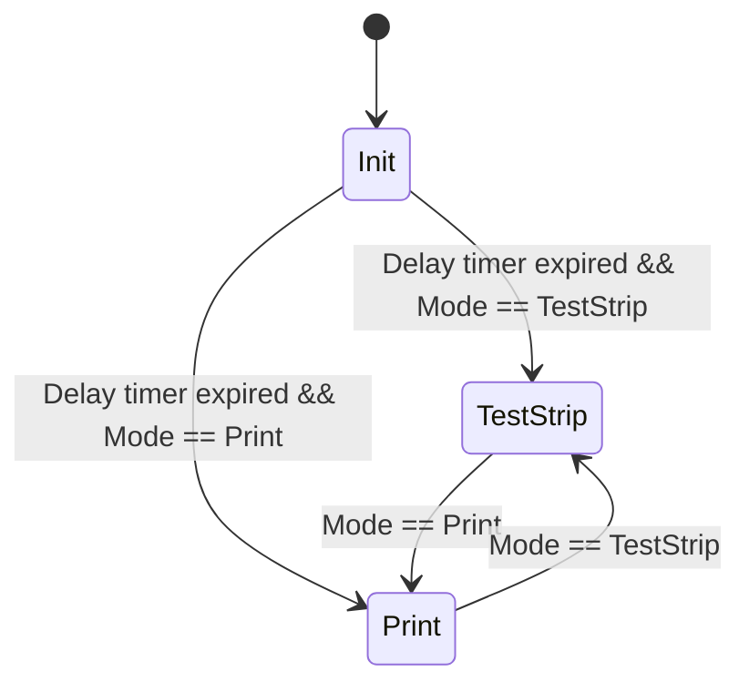
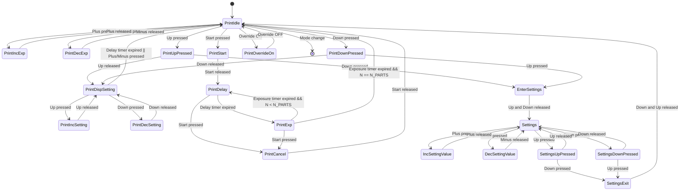
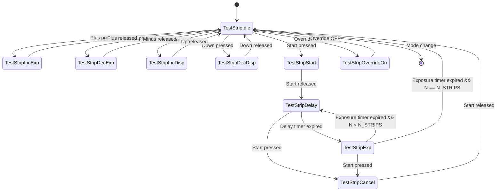

# Enlarger timer

## State-machine

### Overview

```mermaid
stateDiagram
    [*] --> Init
    Init --> TestStrip : Delay timer expired && Mode == TestStrip
    Init --> Print : Delay timer expired && Mode == Print
    TestStrip --> Print : Mode == Print
    Print --> TestStrip: Mode == TestStrip
```
### Print Mode

```mermaid
stateDiagram
    [*] --> PrintIdle
    PrintIdle --> PrintIncExp : Plus pressed
    PrintIdle --> PrintDecExp : Minus pressed
    PrintIdle --> PrintUpPressed : Up pressed
    PrintIdle --> PrintDownPressed : Down pressed
    PrintIdle --> PrintStart : Start pressed
	PrintIdle --> PrintOverrideOn : Override ON
	
	PrintOverrideOn --> PrintIdle : Override OFF

    PrintIncExp --> PrintIdle : Plus released

    PrintDecExp --> PrintIdle : Minus released

    PrintUpPressed --> PrintDispSetting : Up released
    PrintUpPressed --> EnterSettings : Down pressed

    PrintDownPressed --> PrintDispSetting : Down released
    PrintDownPressed --> EnterSettings : Up pressed
	
    PrintDispSetting --> PrintIdle : Delay timer expired || Plus/Minus pressed
    PrintDispSetting --> PrintIncSetting : Up pressed
    PrintDispSetting --> PrintDecSetting : Down pressed

    PrintIncSetting --> PrintDispSetting : Up released

    PrintDecSetting --> PrintDispSetting : Down released

    PrintStart --> PrintDelay : Start released

    PrintDelay --> PrintExp : Delay timer expired
    PrintDelay --> PrintCancel : Start pressed

    PrintCancel --> PrintIdle : Start released

    PrintExp --> PrintCancel : Start pressed
    PrintExp --> PrintDelay : Exposure timer expired && N < N_PARTS
    PrintExp --> PrintIdle : Exposure timer expired && N == N_PARTS

	EnterSettings --> Settings : Up and Down released
	
	Settings --> IncSettingValue : Plus pressed
	Settings --> DecSettingValue : Minus pressed
	Settings --> SettingsUpPressed : Up pressed
	Settings --> SettingsDownPressed : Down pressed
	
	SettingsUpPressed --> Settings : Up released
	SettingsUpPressed --> SettingsExit : Down pressed
	
	SettingsDownPressed --> Settings : Down released
	SettingsDownPressed --> SettingsExit : Up pressed
	
	IncSettingValue --> Settings : Plus released
	
	DecSettingValue --> Settings : Minus released
	
	SettingsExit --> PrintIdle : Down and Up released

    PrintIdle --> [*] : Mode change
```

### Test Strip Mode

```mermaid
stateDiagram
    [*] --> TestStripIdle
    TestStripIdle --> TestStripIncExp : Plus pressed
    TestStripIdle --> TestStripDecExp : Minus pressed
    TestStripIdle --> TestStripIncDisp : Up pressed
    TestStripIdle --> TestStripDecDisp : Down pressed
    TestStripIdle --> TestStripStart : Start pressed
	TestStripIdle --> TestStripOverrideOn : Override ON
	
	TestStripOverrideOn --> TestStripIdle : Override OFF

    TestStripIncExp --> TestStripIdle : Plus released

    TestStripDecExp --> TestStripIdle : Minus released

    TestStripIncDisp --> TestStripIdle : Up released

    TestStripDecDisp --> TestStripIdle : Down released

    TestStripStart --> TestStripDelay : Start released

    TestStripDelay --> TestStripExp : Delay timer expired
    TestStripDelay --> TestStripCancel : Start pressed

    TestStripCancel --> TestStripIdle : Start released

    TestStripExp --> TestStripCancel : Start pressed
    TestStripExp --> TestStripDelay : Exposure timer expired && N < N_STRIPS
    TestStripExp --> TestStripIdle : Exposure timer expired && N == N_STRIPS

    TestStripIdle --> [*] : Mode change
```
